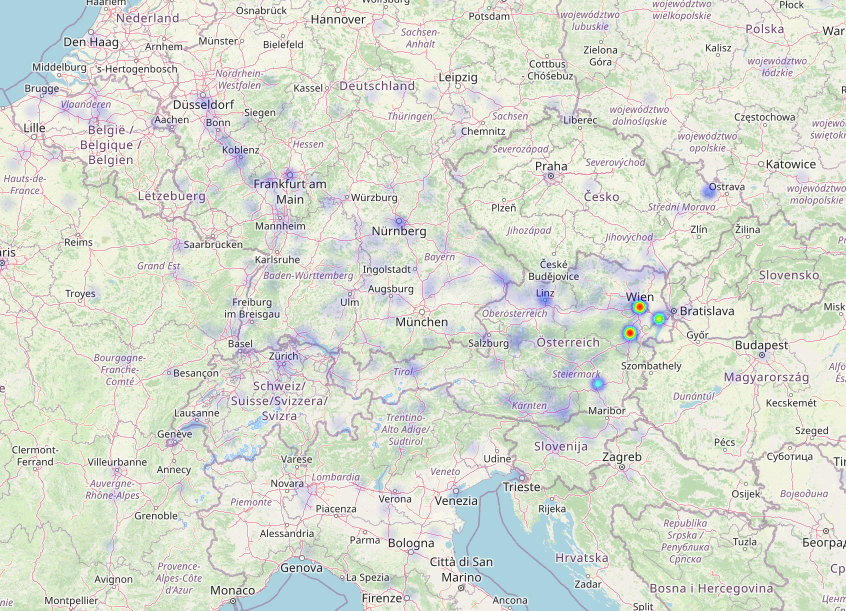

#Contains some visualization helpers

## Preparation

Install the [nice and simple map projector](https://github.com/luka1199/geo-heatmap) of @luka1199 .

It is used to visualize your most frequented spots based on your google map history. So we can convert our RI predictions to the google style format and project them on maps.

## format data to google-firendly format for a specific emperor

Here we take Friedrich III:

```
python export_google_map_geo_history_like_json.py -itinerary_file ../src/predictions/charter_locations_1-centers_added.json -emperor "Friedrich III."
```

To get data of other entities which whom he interacted:

```
python export_google_map_geo_history_like_json.py -itinerary_file ../src/predictions/NE_locations_1-centers_added.json -emperor "Friedrich III."
```

A list with all other available emperors can be printed with

```
python export_google_map_geo_history_like_json.py --only_show_possible_emperors

```

## plot

```
python geo_heatmap.py -mo 0.1 googlemaphistory/googlemaphistory-Friedrich_III.-charter.json
```

This will write an html and open a browser window with the heatmap. It should look similar to 


